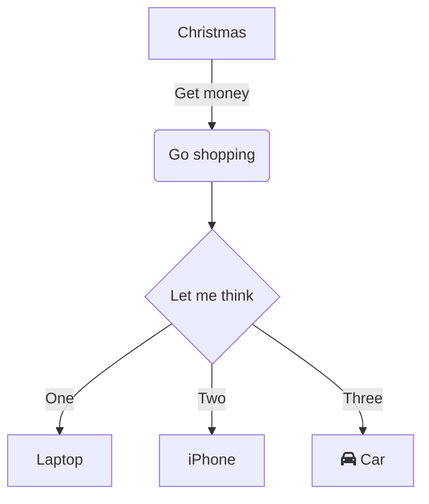

1, 2, 3, probando...


- [astro-obsidian-en-netlify](astro-obsidian-en-netlify.md)
- [third-post](third-post.md)


### Code test
```js
console.log('Hello World!');
```

```sh
cd /hello/world -l -a
```

## Mermaid test


## Math test

Inline: $e^{2i\pi} = 1$

Block:
$$ e^{2i\pi} = 1 $$

$$ \int_0^\infty = \frac{1}{x^2+1} \;dx=\frac{\pi}{2}  $$

Lorem ipsum dolor sit amet, consectetur adipiscing elit, sed do eiusmod tempor incididunt ut labore et dolore magna aliqua. Vitae ultricies leo integer malesuada nunc vel risus commodo viverra. Adipiscing enim eu turpis egestas pretium. Euismod elementum nisi quis eleifend quam adipiscing. In hac habitasse platea dictumst vestibulum. Sagittis purus sit amet volutpat. Netus et malesuada fames ac turpis egestas. Eget magna fermentum iaculis eu non diam phasellus vestibulum lorem. Varius sit amet mattis vulputate enim. Habitasse platea dictumst quisque sagittis. Integer quis auctor elit sed vulputate mi. Dictumst quisque sagittis purus sit amet.
